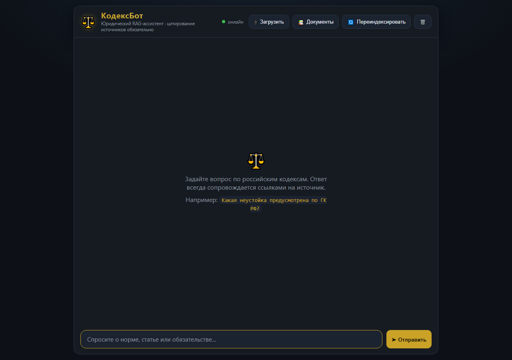
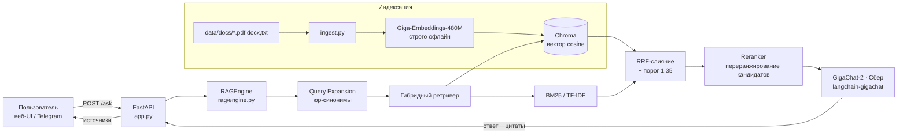

# ⚖️ КодексБот — юридический RAG-ассистент на GigaChat

[](LICENSE)
[](https://www.python.org/)
[](https://developers.sber.ru/gigachat)
[](https://www.trychroma.com/)
[](docs/ARCHITECTURE.md)
[](docs/ARCHITECTURE.md)
[](#-безопасность)
[](docs/DEPLOY.md)
[](app.py)
[](https://github.com/Gopota58/kodeksbot/actions/workflows/ci.yml)

**КодексБот** отвечает на вопросы по российскому законодательству строго на основе
загруженного корпуса (26 кодексов РФ) и **всегда цитирует источник** — кодекс, статью и
фрагмент. Поиск работает на гибридном ретривере (векторный семантический поиск + BM25),
а генерация — на российской языковой модели **GigaChat** (Сбер). Проект задеплоен в
**Yandex Cloud** и работает целиком в российском контуре.

> Под капотом переиспользуется проверенное RAG-ядро (форк проекта «Котобаза»):
> offline-first, model-agnostic, с гибридным ретривером и оценкой качества.

---

## ✨ Возможности

- 🔍 **Гибридный поиск** — векторный cosine (Chroma) + BM25/TF-IDF, слияние через
  Reciprocal Rank Fusion (RRF). Точнее чистого cosine на русском языке.
- 🏆 **Reranker поверх гибридной выдачи** — подключаемая модель переранжирования
  (`rerank_model`) переупорядочивает кандидатов и поднимает релевантный фрагмент в топ,
  повышая точность цитирования. По умолчанию — лёгкий и быстрый `all-MiniLM-L6-v2`
  (bi-encoder, CPU-friendly); опционально — мультиязычный cross-encoder
  `jina-reranker-v2-base-multilingual` для максимального качества на GPU.
- 📚 **Обязательное цитирование** — под каждым ответом блок «Источники» с карточками
  (кодекс / страница / фрагмент + кнопка «Копировать фрагмент»).
- 🧠 **Локальные русскоязычные эмбеддинги** — `Giga-Embeddings-instruct-480M` (Сбер,
  офлайн, без обращения к сети).
- 🤖 **Генерация на GigaChat** (Сбер) через `langchain-gigachat` — SDK сам делает OAuth,
  обновляет токен и ведёт retry/SSL.
- 📄 **Загрузка своих документов** — PDF / DOCX / TXT через drag-&-drop прямо в веб-интерфейсе.
- 🌗 **Тёмный веб-интерфейс** в «юридическом» стиле (золото/бордовый), адаптивный,
  с историей диалога в `localStorage` (XSS-safe рендер).
- 💬 **Telegram-бот** и десктоп-клиент — опционально (включены в репозиторий).
  Боту нужен `TELEGRAM_BOT_TOKEN`; `/ask` он дергает публичным ключом, `/reindex` —
  админским.
- ☁️ **Деплой в Yandex Cloud** — Docker Compose на Compute VM, CPU-only.
- 🛡 **Разделение ключей доступа** — публичный ключ открывает только `/ask`; загрузка,
  переиндексация и удаление документов требуют отдельный админский ключ, который в
  открытую статику не попадает.
- ⏱ **Rate limiting** — скользящее окно на IP для `/ask` и админ-эндпоинтов (429 +
  `Retry-After`), чтобы публичное демо не выжигало квоту GigaChat.

---

## 🖥 Демо

Веб-интерфейс (тёмная «юридическая» тема, обязательное цитирование источников):



> Живой стенд развёрнут в Yandex Cloud (Docker Compose, CPU). Адрес демо не
> публикуется: стенд на бесплатном гранте, а `/ask` упирается в квоту GigaChat —
> поднимите свой экземпляр по [docs/DEPLOY.md](docs/DEPLOY.md) или запустите локально.

---

## 🏗 Архитектура



Подробнее — в [docs/ARCHITECTURE.md](docs/ARCHITECTURE.md).

---

## 🚀 Быстрый старт

### Локально

```bash
# 1. Зависимости (Python 3.12+)
pip install --extra-index-url https://download.pytorch.org/whl/cpu -r requirements.txt
#   индекс PyTorch обязателен: torch запинен CPU-сборкой (+cpu), на PyPI её нет

# 2. Конфиг (секреты — только в .env, он в .gitignore)
cp .env.example .env
#   открой .env и впиши LLM_API_KEY (Authorization key из developers.sber.ru)

# 3. Веса модели эмбеддингов (в репозиторий не входят — см. «Что не лежит в репозитории»)
python download_model.py

# 4. Положить документы в data/docs/ (PDF / DOCX / TXT) и построить индекс
python ingest.py

# 5. Запустить сервер
uvicorn app:app --port 8000
#    открыть http://localhost:8000
```

> **Что не лежит в репозитории.** `models/` (≈1.3 ГБ весов) и `data/docs/` (26 PDF
> кодексов) исключены через `.gitignore` — репозиторий держим лёгким. Модель
> ставится шагом 3 (`python download_model.py`, один раз, нужен доступ к
> Hugging Face); в рабочем режиме приложение грузит веса **строго с диска**
> (`HF_HUB_OFFLINE=1`) и в сеть не ходит. Корпус — свой: положите документы в
> `data/docs/` и запусти `python ingest.py`; без модели и корпуса `/ask` не заработает.

Проверка чата:

```bash
curl -X POST http://localhost:8000/ask \
  -H "Content-Type: application/json" \
  -H "X-API-Key: $API_KEY" \
  -d "{\"question\":\"Какая ответственность за задержку зарплаты?\"}"
```

### Docker

```bash
cp .env.example .env          # заполнить LLM_API_KEY
docker compose up --build
```

> В Docker-контейнере эмбеддинги считаются на CPU (`EMBED_DEVICE=cpu`), torch
> собирается в CPU-варианте, чтобы влезть в малый объём памяти/диска.

---

## ☁️ Деплой в Yandex Cloud (Compute VM)

Полное описание — в [docs/DEPLOY.md](docs/DEPLOY.md). Кратко:

1. Compute VM **Ubuntu 24.04**, 2 vCPU / 4 ГБ / 30 ГБ, публичный IP.
2. Установить **Docker + Docker Compose**.
3. Перенести проект (готовые `models/` ~1.3 ГБ + `chroma_db/` + `data/docs/`),
   выключить вотчер реиндексации.
4. `Dockerfile` собирается с `python:3.12-slim` (numpy 2.5.2 требует ≥3.12),
   `torch==2.14.0+cpu` + индекс PyTorch CPU, `requirements.txt` — строго в UTF-8.
5. Переменные: `EMBED_DEVICE=cpu`, `GIGACHAT_CA_BUNDLE_FILE=/app/certs/Russian_Trusted_Root_CA.pem`,
   `ADMIN_API_KEY` (отдельно от публичного `API_KEY`).
6. `docker compose up -d`; открыть TCP 8000 в группе безопасности.
7. Эксплуатация: swap-файл 2 ГБ (`vm.swappiness=10`) — страховка от OOM на 4 ГБ RAM;
   периодически `docker builder prune -f` (build cache разрастается до ~12 ГБ).

Проверено end-to-end: `/health` → `{"status":"ok"}`, `/ask` отвечает со ссылками на статьи
ТК РФ / ГК РФ.

---

## ⚙️ Конфигурация (`.env`)

| Переменная | Назначение | По умолчанию |
|---|---|---|
| `API_KEY` | публичный ключ: только `/ask`. Зашит в `static/index.html`, поэтому **не секрет**. Меняя его, правьте и там | `kb_pub_…` (см. `.env.example`) |
| `ADMIN_API_KEY` | админский ключ: `/upload`, `/ingest`, `/documents`, `DELETE /documents/{file}`. В статику не попадает | — (пусто → берётся `API_KEY`) |
| `RATE_LIMIT_ENABLED` | включить ограничение частоты запросов | `true` |
| `RATE_LIMIT_PER_MINUTE` | лимит `/ask` на один IP | `30` |
| `RATE_LIMIT_ADMIN_PER_MINUTE` | лимит админ-эндпоинтов на один IP | `10` |
| `LLM_PROVIDER` | провайдер LLM | `gigachat` |
| `LLM_API_KEY` | Authorization key из консоли GigaChat | — |
| `LLM_MODEL` | id модели (см. `GET /v1/models`) | `GigaChat-2` |
| `GIGACHAT_BASE_URL` | эндпоинт GigaChat | `https://api.giga.chat/v1` |
| `GIGACHAT_VERIFY_SSL_CERTS` | проверка SSL | `true` |
| `GIGACHAT_CA_BUNDLE_FILE` | российский root-CA (нужен на Windows/в облаке) | — |
| `EMBED_PROVIDER` | провайдер эмбеддингов | `local` |
| `EMBEDDING_MODEL_ID` / `model_dir` | локальная модель эмбеддингов | `Giga-Embeddings-instruct-480M-0826` |
| `EMBED_DEVICE` | устройство эмбеддингов | `cuda` (локально) / `cpu` (облако) |
| `RETRIEVER_K` | сколько чанков отдавать в контекст LLM | `8` |
| `ENABLE_HYDE` | HyDE: +1 вызов GigaChat на запрос, лучше семантика | `false` |
| `RERANK_MODEL` | путь к модели-рерanker (SentenceTransformer bi-encoder, напр. `all-MiniLM-L6-v2`, или cross-encoder jina); пусто — без переранжирования | — |
| `ALLOWED_ORIGINS` | CORS (через запятую, `*` — все) | `*` |

Полный список эндпоинтов и нюансы интеграции GigaChat — в [docs/API.md](docs/API.md).

---

## 📂 Структура проекта

```
kodeksbot/
├── app.py                 # FastAPI: /ask, /ingest, /upload, /documents, /health + rate limiting
├── config.py              # настройки из .env (pydantic-settings)
├── ingest.py              # CLI: построение индекса Chroma из data/docs/
├── download_model.py      # явное скачивание весов эмбеддингов в models/ (один раз)
├── rag/engine.py          # ядро RAG: эмбеддинги, Chroma, гибридный ретривер, GigaChat
├── static/index.html      # тёмный веб-чат (vanilla JS/CSS, без сборщиков)
├── static/favicon.svg     # иконка (весы Фемиды)
├── bot.py / desktop_client.py  # Telegram-бот / десктоп-клиент (опц.)
├── start.sh / Makefile    # быстрый запуск и типичные команды
├── data/docs/             # корпус: 26 кодексов РФ (PDF/DOCX) — в .gitignore
├── models/                # веса эмбеддингов и reranker — в .gitignore
├── certs/                 # Russian Trusted Root CA (для SSL GigaChat)
├── docs/                  # документация (Уровень 2) + docs/assets/ui.png
├── tests/                 # pytest-набор (герметичный: без сети, GPU и рабочего корпуса)
├── evaluation/            # golden-датасет и метрики качества
├── Dockerfile / docker-compose.yml / docker-entrypoint.sh
└── .github/workflows/ci.yml
```

---

## 🧪 Оценка качества

Каталог `evaluation/` содержит golden-датасет (`golden_dataset.json`), счёт метрик
(`metrics.py`) и сценарий прогона (`run_eval.py`). CI прогоняет `ruff` + `pytest` на
каждый push/PR (`ubuntu-latest`, Python 3.12).

---

## 🗺 Дорожная карта

- [x] Гибридный ретривер (вектор + BM25/RRF), порог иррелевантности 1.35.
- [x] Локальные русскоязычные эмбеддинги (Giga-Embeddings-480M, офлайн).
- [x] Генерация на GigaChat + обязательное цитирование источников.
- [x] Деплой в Yandex Cloud (Docker Compose, CPU).
- [x] Reranker поверх гибридной выдачи (по умолчанию `all-MiniLM-L6-v2`, опц. cross-encoder jina).
- [x] Rate limiting и разделение публичного/админского ключей доступа.
- [ ] TLS + reverse-proxy перед демо-стендом (домен, Let's Encrypt).
- [ ] Смена эмбеддинга на `ai-forever/sbert_large_nlu_ru` (выше качество, тяжелее).
- [ ] Расширение корпуса и мультиарендность.

---

## 🔒 Безопасность

- Реальный `.env` **не коммитится** (в `.gitignore`); секреты — только в переменных
  окружения или Yandex Lockbox, никогда в образе.
- **Ключи разделены по зонам ответственности.** Публичный `API_KEY` открывает только
  `/ask`. Он намеренно лежит в `static/index.html`, поэтому считается публичным: его
  видит любой посетитель демо. Всё, что меняет состояние — `/upload`, `/ingest`,
  `/documents`, `DELETE /documents/{file}` — требует `ADMIN_API_KEY`, который в статику
  не попадает и вводится вручную в UI (кнопка 🔑, хранится в `localStorage`).
  Без такого разделения публичный ключ из HTML позволял бы любому удалить корпус.
- **Rate limiting.** Скользящее окно на IP: `/ask` — 30 запросов/мин, админ-эндпоинты —
  10/мин. Превышение → `429` с заголовком `Retry-After`. Защищает квоту GigaChat от
  случайного или намеренного выжигания на открытом демо.
- `API_KEY`/`ADMIN_API_KEY` по умолчанию слабые — **обязательно смените** на продакшн-сервере
  (`python -c "import secrets;print(secrets.token_urlsafe(24))"`).
- GigaChat-ключ используется только для получения OAuth-токена SDK; сырой ключ никуда
  не уходит как Bearer.
- **Что ещё стоит сделать при выходе за пределы демо:** терминировать TLS перед приложением
  (домен + reverse-proxy с Let's Encrypt), закрыть порт 8000 в группе безопасности и
  оставить наружу только 443, вынести rate limiting в Redis при нескольких репликах.

---

## ⚠️ Ограничения

- **Не юридическая консультация.** Ассистент отвечает по загруженному корпусу и
  может ошибаться, а законы меняются — сверяйтесь с официальными источниками.
- **Качество = корпус + модель.** Ответ формируется только по найденным фрагментам;
  если в корпусе нет ответа, ассистент так и скажет (порог иррелевантности 1.35).
- **GigaChat недетерминирован** даже при `temperature=0` — на коротких запросах
  возможны ложные «нет ответа».
- **Rate limiting живёт в памяти процесса** — при нескольких репликах нужен общий
  стор (Redis).
- Индекс зависит от модели эмбеддингов: смена модели ⇒ обязательная пересборка
  (`python ingest.py`).

---

## 📄 Лицензия

[MIT](LICENSE) © 2026 Gopota58.

---

## 🔗 Ссылки

- [Архитектура](docs/ARCHITECTURE.md)
- [Деплой в Yandex Cloud](docs/DEPLOY.md)
- [API и интеграция GigaChat](docs/API.md)
- [AGENTS.md](AGENTS.md) — карта проекта для агентов
